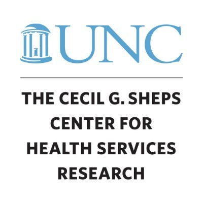
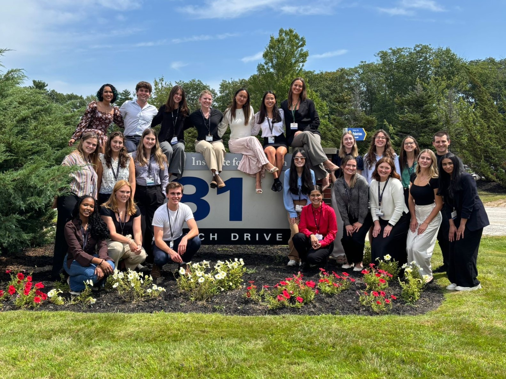
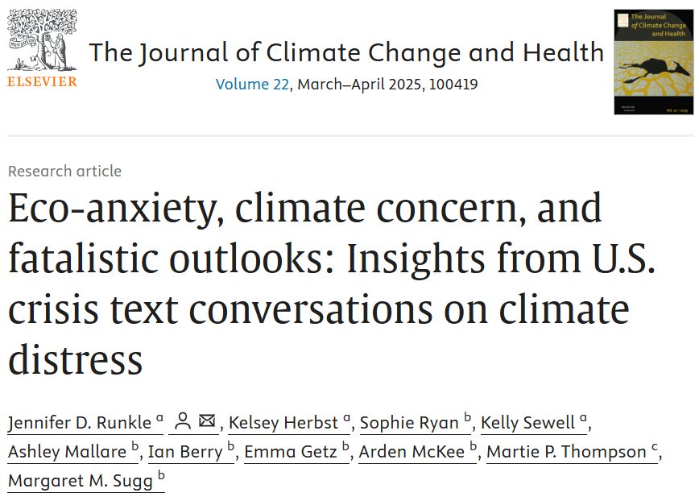

**→** <a href="Getz_CV_2026.pdf" style="color: #9e1c57; text-decoration: none;">View My CV</a> 

I'm a public health professional based in Chapel Hill, NC, with a background that bridges quantitative analysis and community-level work. I came into public health drawn to the question of how rurality shapes health outcomes and access to care, and that interest has carried through nearly everything I've done since. I've enjoyed working across public health domains, from evaluating a mental health intervention in Western NC to studying crisis service availability across the state.

What I've found along the way is a real interest in evaluation itself: understanding whether programs are working, and using data to make the case for what comes next. That's taken me through research settings as varied as psychiatric health data analysis, climate-related crisis text lines, and a study on disease prevention among Appalachian Trail hikers; each one sharpening how I think about turning data into something useful for the people making decisions.

I'm currently looking for my next role in public health, ideally one where I can keep working to make a difference in public health. More on my experience below.

## Academic and Professional Highlights:

::::: about-card
::: {style="flex: 2;"}
[Cecil G. Sheps Center for Health Services Research](https://www.shepscenter.unc.edu/): Research Assistant, NC-BELL

As a Research Assistant with the [NC Behavioral Health Evaluation and Learning Lab (NC-BELL)](https://www.shepscenter.unc.edu/news_release/launching-nc-bell-a-collaborative-evaluation-of-crisis-and-child-behavioral-health-systems-in-north-carolina/), I supported a state-funded initiative evaluating crisis and child behavioral health systems in North Carolina. I conducted literature reviews on crisis services, behavioral health, and psychiatric hospitalizations to inform study design, and compiled data on NC crisis service providers by integrating multiple secondary data sources. I also developed data collection guides and documentation protocols to support reproducibility, and authored summary reports presenting findings to state-level stakeholders.
:::

::: {style="flex: 1;"}

:::
:::::

::::: about-card
::: {style="flex: 2;"}
[Public Health Departmental Honors Program](https://phes.appstate.edu/academic-programs/public-health/public-health-student-resources/departmental-honors-public-health): Honors Thesis

For my Honors thesis, I researched tick-borne illness prevention among long-distance Appalachian Trail hikers. This project involved designing a study from the ground up, including developing a survey, analyzing data, and authoring a formal manuscript. I established a professional partnership with the [Appalachian Trail Conservancy](https://appalachiantrail.org/?campaignid=21861446043&adgroupid=169528959243&adid=719572099833&gad_source=1&gad_campaignid=21861446043&gbraid=0AAAAAD-wfPlcBZZmlM_Iu3XQf4GwT1d_0&gclid=CjwKCAiA_orJBhBNEiwABkdmjBRhG6actlAh4Pnzp8M4XufR_68EMpWW9Lql6XaZc0QpHp1ERUqykhoCLEQQAvD_BwE), led two presentations on tick-borne illness at their Damascus Trail Center, and contributed a [blog post on tick safety](https://appalachiantrail.org/news-stories/tick-smart-trail-tips/) for their website. This experience combined my research interests with practical application, culminating in the successful defense of my thesis and publication in Wilderness and Environmental Medicine. Read the paper [here](https://pubmed.ncbi.nlm.nih.gov/42334346/). 
:::

::: {style="flex: 1;"}

:::
:::::

::::: about-card
::: {style="flex: 2;"}
[Public Health AmeriCorps](https://phes.appstate.edu/americorps) Fellowship: Evaluation Team Lead and Lead Fellow

As evaluation team lead, I guided a team evaluating a public health intervention focused on rural mental health and analyzed program data to assess outcomes. This role strengthened my applied public health skills, data analysis expertise, and leadership abilities. Additionally, I authored an abstract based on our evaluation, presented the findings at the [2025 NC Data Summit](https://ncpha.memberclicks.net/nc-public-health-data-summit), and attended the 2025 [NACCHO Prep Summit](https://www.preparednesssummit.org/home).

In my second fellowship year, I served as Lead Fellow, coordinating program logistics across multiple concurrent professional development initiatives for AmeriCorps members. I organized programming, including career panels, resume workshops, and skill-building trainings, to strengthen fellows' job readiness. I also managed conference participation and presentation logistics for the cohort. I also designed and executed a recruitment and outreach strategy, including promotional materials and stakeholder events, to expand the program's visibility across rural communities.
:::

::: {style="flex: 1;"}

:::
:::::

::::: about-card
::: {style="flex: 2;"}
[MaineHealth Institute for Research](https://mhir.org/): Research Intern

During the [Summer Undergraduate Research Program](https://mhir.org/education-training/undergraduate-summer-student-research-program/summer-student-program/), I collaborated with Dr. Kahsi Pedersen on a project characterizing profound autism within specialized inpatient psychiatric facilities. My responsibilities included analyzing data from a 15-year study, utilizing data visualization techniques, authoring a manuscript for peer-reviewed publication, and presenting findings through a poster and a 3-Minute Thesis presentation. In this role, I learned about clinical research skills and strengthened my data analysis techniques. I was honored to receive the Paul Gray Research Scholarship to support this work.
:::

::: {style="flex: 1;"}

:::
:::::

::::: about-card
::: {style="flex: 2;"}
[AppHealthCare](https://www.apphealthcare.com/): YRBS Volunteer

Volunteering with AppHealthCare, I analyzed Youth Risk Behavior Survey data from six local schools, identifying patterns in youth risk behaviors across Western North Carolina. We created visualizations and summary reports for local stakeholders, using data to inform public health strategies and support community decision-making.
:::

::: {style="flex: 1;"}

:::
:::::

::::: about-card
::: {style="flex: 2;"}
[Research Institute for Environment, Energy, and Economics](https://rieee.appstate.edu/): Research Assistantship

As a Research Assistant at Appalachian State University’s Research Institute for Environment, Energy, and Economics I collaborated with a team to analyze crisis text conversations, focusing on themes of eco-anxiety and climate worry. Through thematic analysis, I contributed to identifying and interpreting patterns in these critical discussions, providing insights into the mental health impacts of environmental concerns. I contributed to a formal manuscript based on this work titled [“Eco-Anxiety, Climate Concern, and Fatalistic Outlooks: Insights from U.S. Crisis Text Conversations on Climate Distress”](https://www.sciencedirect.com/science/article/pii/S2667278225000094) which is currently published in the Journal of Climate Change and Health. Check out [this article](https://cas.appstate.edu/news/app-state-research-shows-impact-climate-stress-youth-mental-health) about our work!
:::

::: {style="flex: 1;"}

:::
:::::
